# **Traffic Light Classifier**

In this project, we'll use computer vision techniques to build a classifier for images of traffic lights! In the folder [traffic_light_images](traffic_light_images/) there is a dataset of traffic light images in which one of three lights is illuminated: red, yellow, or green.

In this notebook, we'll pre-process these images, extract features that will help us distinguish the different types of images, and use those features to classify the traffic light images into three classes: red, yellow, or green. The tasks will be broken down into a few sections:

1. **Loading and visualizing the data**   
      The first step in any classification task is to be familiar with your data; we'll load in the images of traffic lights and visualize them!

2. **Pre-processing**   
    The input images and output labels need to be standardized. This way, we can analyze all the input images using the same classification pipeline, and we know what output to expect when we eventually classify a *new* image.
    
3. **Feature extraction**   
    Next, we'll extract some features from each image that will help distinguish and eventually classify these images.
   
4. **Classification and visualizing error**   
    Finally, we'll write one function that uses our features to classify *any* traffic light image. This function will take in an image and output a label. We'll also determine the accuracy of our classification model.    
    
5. **Evaluate the model**  
    Our classifier must be >90% accurate and never classify any red lights as green. Classifying red lights as green would cause a car to drive through a red traffic light, so this red-as-green error is very dangerous in the real world.
    
Here are some sample images from the dataset (from left to right: red, green, and yellow traffic lights):


---
## How to use the code

1. You will need OpenCV for this code to work.   
> [OpenCV](https://opencv.org/releases/) (Open Source Computer Vision Library) is an open source computer vision and machine learning software library. The library has more than 2500 optimized algorithms, which includes a comprehensive set of both classic and state-of-the-art computer vision and machine learning algorithms. These algorithms can be used to detect and recognize faces, identify objects, classify human actions in videos, track camera movements, track moving objects, extract 3D models of objects, etc.  
  
Follow the instructions in this [website](https://learnopencv.com/category/install/) to learn how to install OpenCV on your machine.    

2. Clone this repo:  

```bash
cd ~  
git clone https://github.com/nikhilnair8490/UdacityProjects.git
```
3. Go to the project directory [TrafficLightClassifier](../TrafficLightClassifier/). 
4. Run the jupyter notebook *Traffic_Light_Classifier.ipynb* to see the outputs.
5. Feel free to modify the code and see if you can make it more accurate!

---
# Loading and Visualizing the Traffic Light Dataset

This traffic light dataset consists of 1484 number of color images in 3 categories - red, yellow, and green. As with most human-sourced data, the data is not evenly distributed among the types. There are:
* 904 red traffic light images
* 536 green traffic light images
* 44 yellow traffic light images

*Note: All images come from this [MIT self-driving car course](https://selfdrivingcars.mit.edu/) and are licensed under a [Creative Commons Attribution-ShareAlike 4.0 International License](https://creativecommons.org/licenses/by-sa/4.0/).*

- ## Training and Testing Data

    All 1484 of the traffic light images are separated into training and testing datasets. 
    
    * 80% of these images are training images, to create a classifier.
    * 20% are test images, which will be used to test the accuracy of the classifier.
    * All images are pictures of 3-light traffic lights with one light illuminated.
---
# Visualize the Data

The first steps in analyzing any dataset are to 1. load the data and 2. look at the data. Seeing what it looks like will give an idea of what to look for in the images, what kind of noise or inconsistencies we have to deal with, and so on. This will help us understand the image dataset, and **understanding a dataset is part of making predictions about the data**.

Below is a sample image from the training data set which shows all the three lights and their respective shapes.


---
# Pre-process the Data

After loading in each image, the next step is to standardize the input and output!

### Input

This means that every input image should be in the same format, of the same size, and so on. We'll be creating features by performing the same analysis on every picture, and for a classification task like this, it's important that **similar images create similar features**! 

### Output

We also need the output to be a label that is easy to read and easy to compare with other labels. It is good practice to convert categorical data like "red" and "green" to numerical data.

A very common classification output is a 1D list that is the length of the number of classes - three in the case of red, yellow, and green lights - with the values 0 or 1 indicating which class a certain image is. For example, since we have three classes (red, yellow, and green), we can make a list with the order: [red value, yellow value, green value]. In general, order does not matter, we choose the order [red value, yellow value, green value] in this case to reflect the position of each light in descending vertical order.

A red light should have the  label: [1, 0, 0]. Yellow should be: [0, 1, 0]. Green should be: [0, 0, 1]. These labels are called **one-hot encoded labels**.

*(Note: one-hot encoding will be especially important when working with [machine learning algorithms](https://machinelearningmastery.com/how-to-one-hot-encode-sequence-data-in-python/)).*


### Standardize the input images

* Crop the image equally from all sides to remove the background noise
* Resize each image to the input size: 32x32px.

It's very common to have square input sizes that can be rotated (and remain the same size), and analyzed in smaller, square patches. It's also important to make all your images the same size so that they can be sent through the same pipeline of classification steps!

### Standardize the output

With each loaded image, we also specify the expected output. For this, we use **one-hot encoding**.

* One-hot encode the labels. To do this, create an array of zeros representing each class of traffic light (red, yellow, green), and set the index of the expected class number to 1. 

Since we have three classes (red, yellow, and green), we have imposed an order of: [red value, yellow value, green value]. To one-hot encode, say, a yellow light, we would first initialize an array to [0, 0, 0] and change the middle value (the yellow value) to 1: [0, 1, 0].

### Visualize the standardized data

Display a standardized image and compare it with a non-standardized image. Note that their sizes and appearance are different!

***Input Non-Standardised Image***  

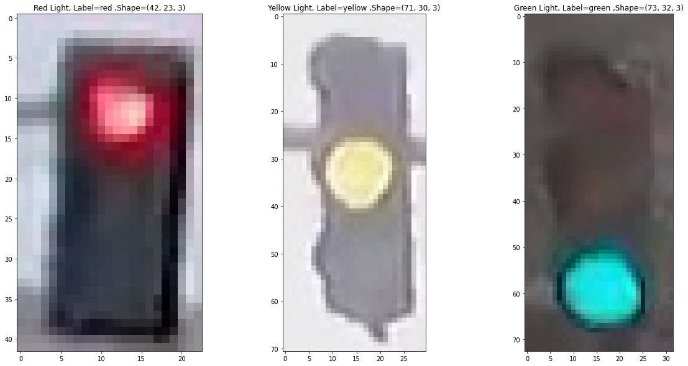  

***Output Standardised Image***

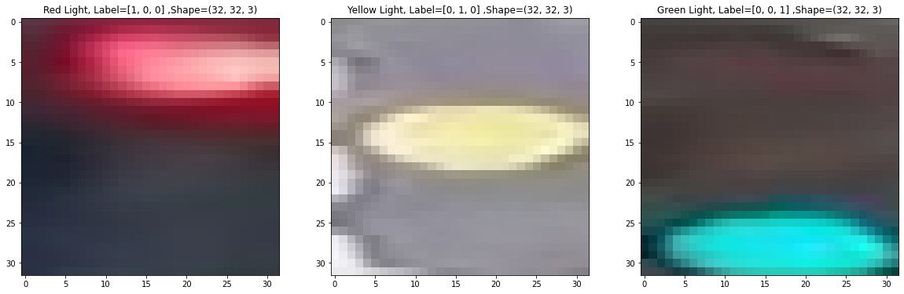

---
# Feature Extraction

We will use some basic computer vision techniques to extract features from the images which will help us classify the three types of traffic light. 

The underlying concept involves identifying the precise color (be it red, yellow or green) and its location within the traffic light image through two distinct methods:

- First, the "create_color_mask" function is used to extract the desired color from the image while simultaneously masking any extraneous elements. This operation is performed to obtain a pixel count within the specified color range.

- Subsequently, the resultant masked image is fed into the "vCh1dVector" function, which generates a one-dimensional array portraying the spatial distribution of luminance (i.e., V channel) across the vertical axis. This process allows for the precise determination of the traffic light's location in the image. Specifically, red lights are expected to appear in the top section, yellow in the middle, and green in the lower portion.

The final classification involves employing both the above techniques. Firstly, the maximum number of pixels within the red, yellow, and green color ranges is determined to classify the traffic light. Secondly, to ensure that the red light is not erroneously classified as green, the second function is utilized to ascertain the precise location of the traffic light in the image. As previously mentioned, the anticipated position of the red light is at the top of the image, while yellow appears in the middle, and green in the lowest portion of the image. 

### RGB to HSV conversion

To learn more details about the image we will convert it from RGB to HSV color space. You can read about HSV [here](https://en.wikipedia.org/wiki/HSL_and_HSV). Below, a test image is converted from RGB to HSV colorspace and each component is displayed in an image.

***HSV Histogram for the Red Traffic Light***  

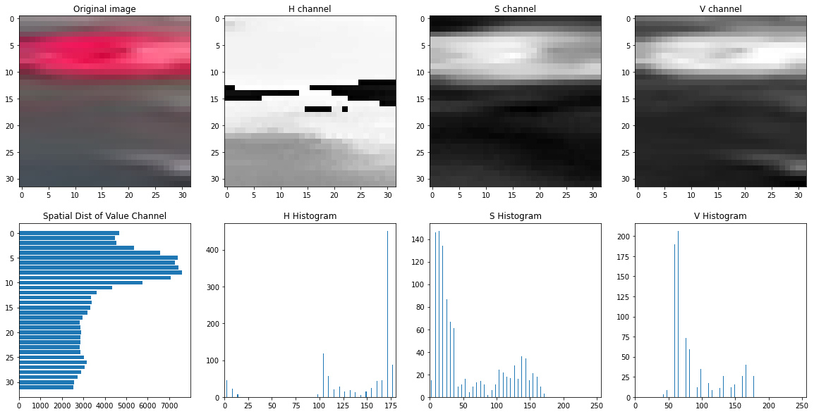  

\
***HSV Histogram for the Yellow Traffic Light*** 


\
***HSV Histogram for the Green Traffic Light*** 

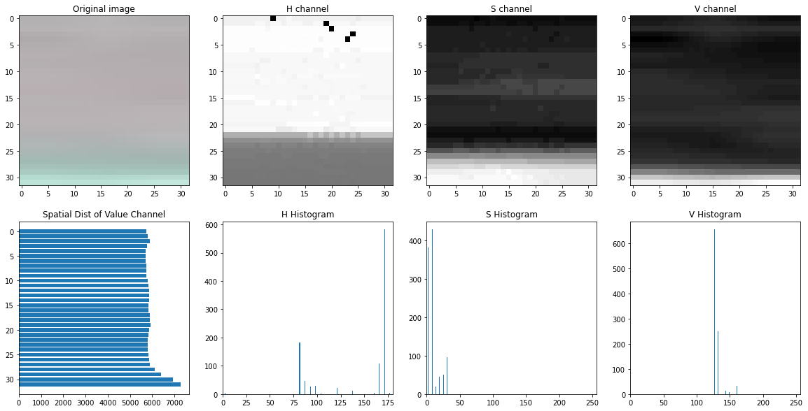  

\
Based on above image analysis, HSV thresholds are defined for each color (Red, Yellow and Green) which will be later used for masking.  
> Also, take note of the spatial distribution of the Value channel, it has a peak at the position where there is a traffic light. This metric will be used in our function *vCh1dVector*


```python
#(H,S,V)
lowerRed = (160, 30, 150)
upperRed = (179, 255, 255)

lowerYellow = (15, 20, 150)
upperYellow = (30, 255, 255)

lowerGreen = (80, 10, 120)
upperGreen = (100, 255, 255)
```

### Color Masking

Using the HSV threshold we defined in the previous step, we can create a color filter which will extract red, yellow or green color from the input standardised image and output a masked image. 
> After masking, all the pixels which do not fall in the HSV threshold are set as black and the masked image only contains the respective colors.
 

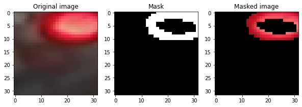  


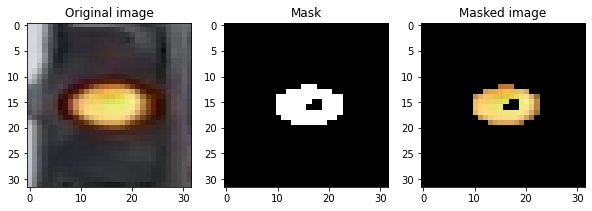


### Visualize the spatial distribution 

 Next we will see the spatial distribution of each color which correlates with their respective position. Red is at the top of the image, yellow somewhere in the middle and green at the bottom. 

> This particular feature ensures that the red traffic light is not mistakenly classified as green light.

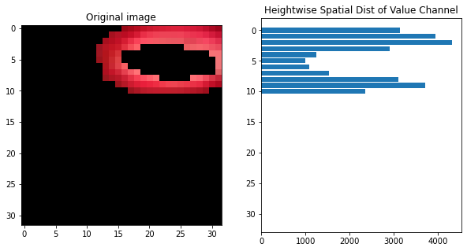  


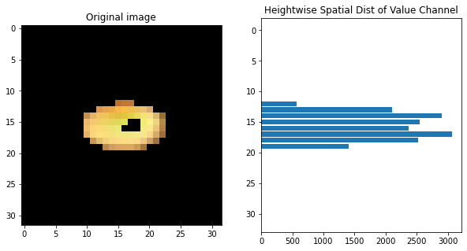


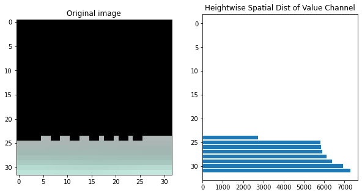

---
# Classification and Visualizing Error

Using all the features that we built before, now we can create a classifier which, given an input standardised image, can output the `one hot encoded label` and classify the image as RED, YELLOW or GREEN traffic light. 

The classifier algorithm works in the following steps:

1. Pass the input standardised image through the color filter `create_color_mask` and extract each colors (red, yellow & green)
2. Count the number of white pixels in each color mask
3. Index the color which has the maximum number of white pixels in the masked image
4. Calculate 1D vector of spatial distribution of luminance in the masked image using function `vCh1dVector`
5. Divide image in three parts and sum the count of pixels in top, middle and down position of image
6. Index the position which has the maximum number of pixels in the image
7. Classify the image based on color and position

### Testing the classifier

Here is where we test your classification algorithm using our test set of data that we set aside at the beginning of the notebook! 

After running through the tests dataset we find the following accuracy results for our algorithm:  

**Accuracy: 0.9764309764309764  
Number of misclassified images = 7 out of 297**

This is a fairly good result as we were able to achieve beyond 90% accuracy using just basic computer vision techniques. Also, the classifier never classified any red light as green.

### Visualize the misclassified images

Visualize some of the images we classified wrong (in the `MISCLASSIFIED` list)

In below image the color filter could not filter out the correct color (which is RED) and instead the output masked image is of YELLOW color.  

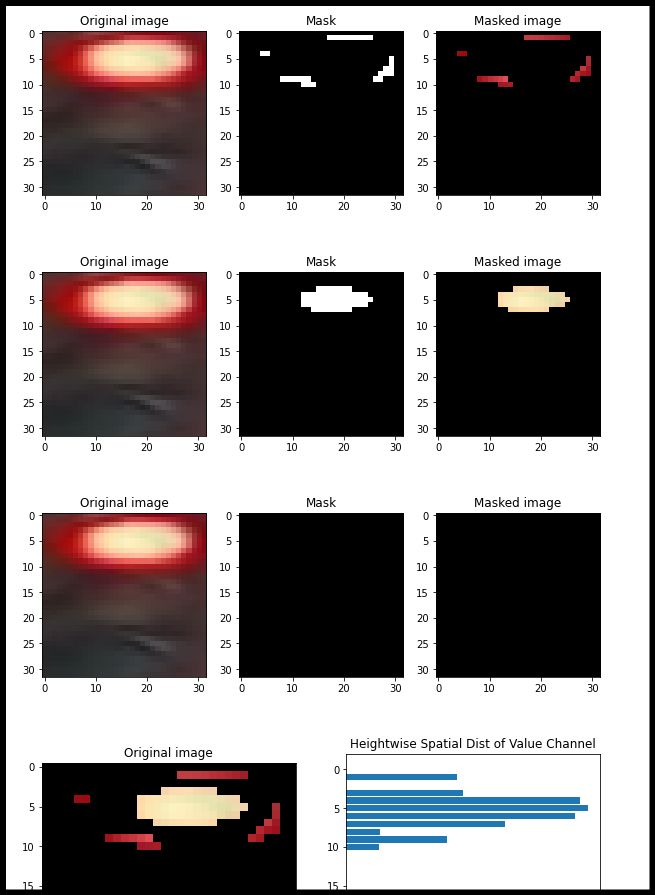
 
\
In this misclassified image, the filter could not extract the yellow color.  

\
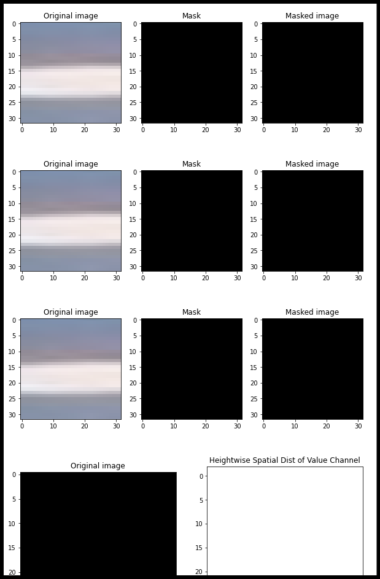   
  
\
**Note:** Both the above examples can be fine tuned by changing the HSV filter parameters but the downside is that correcting the parameters for one image might cause misclassification in others.

---
# Weakness of current algorithm:

1. The current classification algorithm does not work well if the traffic light in the image is tilted by a significant angle.
2. It will also not work if the traffic light is offset too much within the image. The position feature will not be able to detect the position of light accurately. 
3. This algorithm will not give accurate results if there are multiple traffic lights in the image.
4. The algorithm uses fixed values of HSV thresholds for color masking. This can be further improved by using adaptive thresholds or using deep learning techniques.


