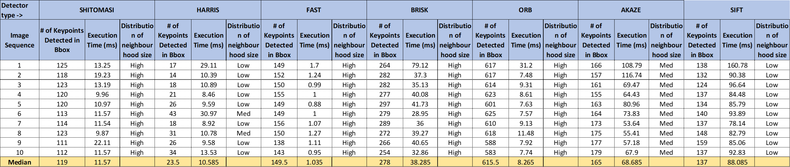
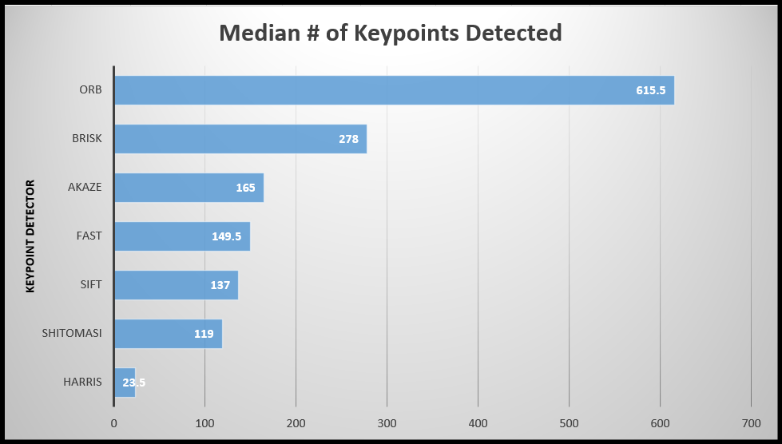
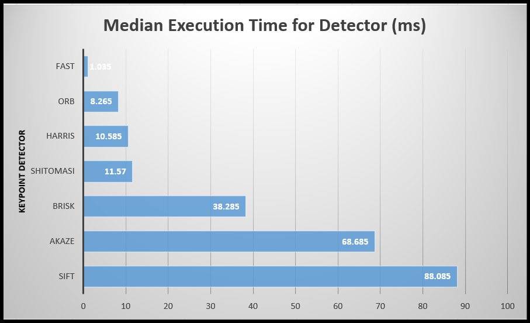
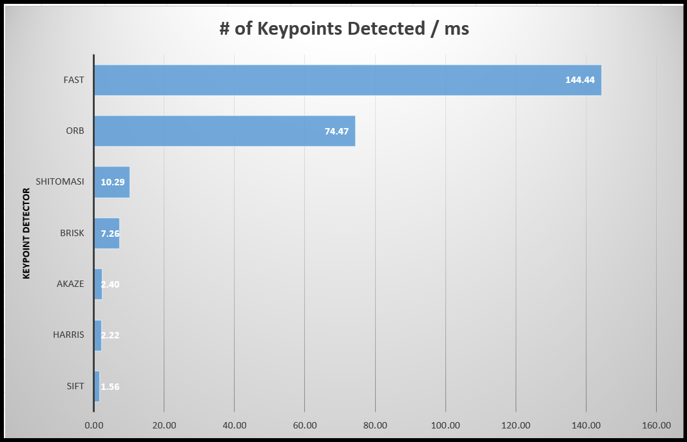
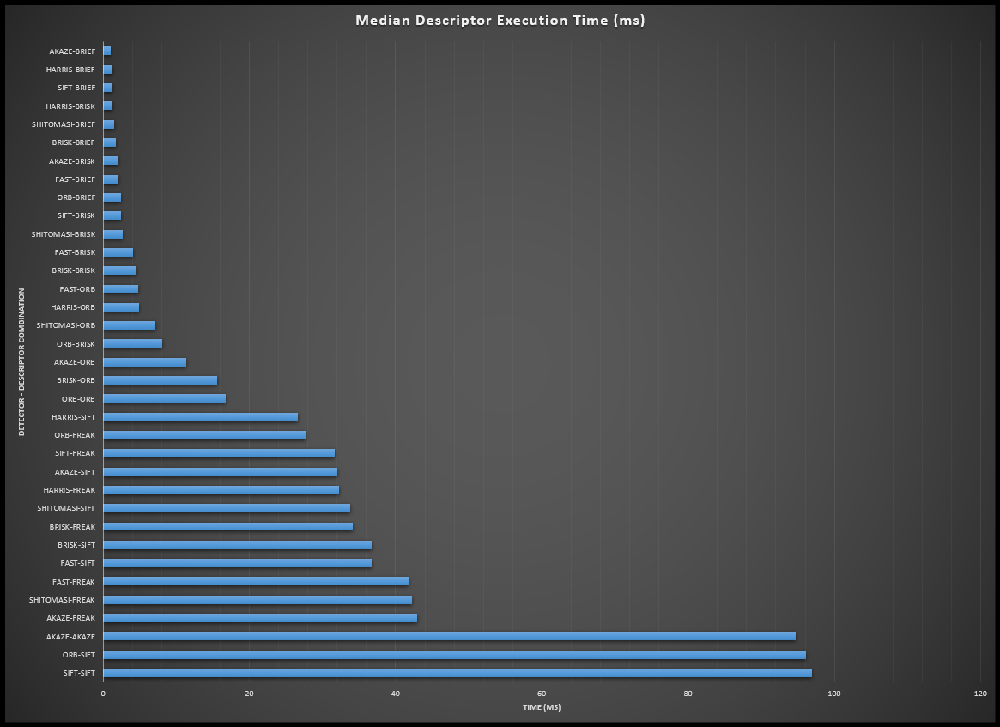
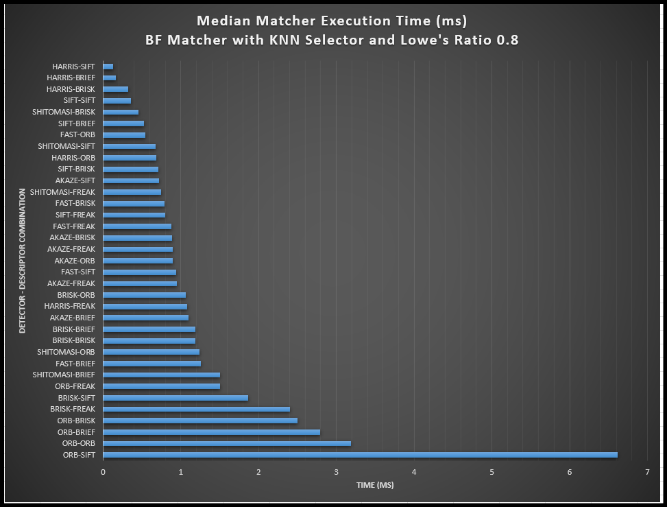
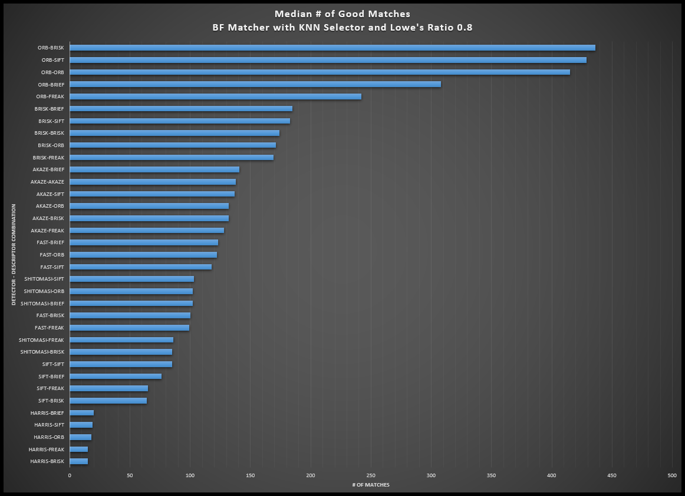
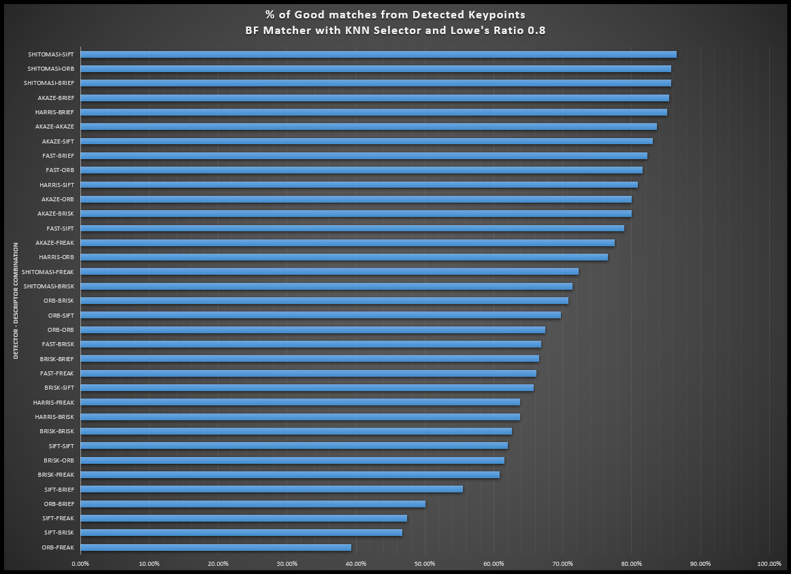
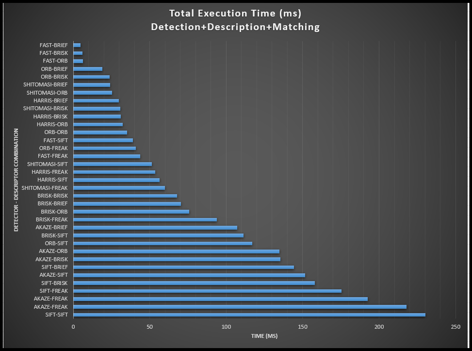

# SFND 2D Feature Tracking


---
## **Project Overview**
This mid term project builds the feature tracking algorithm and test various detector / descriptor combinations to see which ones perform best. The mid-term project consists of four parts:

* First, it focuses on loading images, setting up data structures and putting everything into a ring buffer to optimize memory load. 
* Then, it integrates several keypoint detectors such as HARRIS, FAST, BRISK and SIFT and compare them with regard to number of keypoints and speed. 
* In the next part, the focus is on descriptor extraction and matching using brute force and also the FLANN approach. 
* In the last part, once the code framework is complete, it tests the various algorithms in different combinations and compare them with regard to some performance measures.

---
## Setting up the workspace

1. Tools used in this project:

    - C++ compiler. I prefer using linux, it already has gcc preinstalled.
    
    - OpenCV >= 4.1
      * All OSes: refer to the [official instructions](https://docs.opencv.org/master/df/d65/tutorial_table_of_content_introduction.html)
      * This must be compiled from source using the `-D OPENCV_ENABLE_NONFREE=ON` cmake flag for testing the SIFT and SURF detectors. If using [homebrew](https://brew.sh/): `$> brew install --build-from-source opencv` will install required dependencies and compile opencv with the `opencv_contrib` module by default (no need to set `-DOPENCV_ENABLE_NONFREE=ON` manually). 
      * The OpenCV 4.1.0 source code can be found [here](https://github.com/opencv/opencv/tree/4.1.0)
    
    - To compile and build the project, you will need to have cmake and make installed on your system. You can find instructions for installing cmake here: https://cmake.org/install/
    
    I have used the following versions for this project:  
    - Ubuntu 20.04 LTS
    - C++ 14
    - OpenCV 4.5.0
    - gcc 9.4.0
    - CMake 3.16.3


2. Clone this repository to your local machine
```bash
cd ~  
git clone https://github.com/nikhilnair8490/UdacityProjects.git
```
1. Go to the project folder

`UdacityProjects/Sensor_Fusion_Engineer/Camera/SFND_2D_Feature_Tracking-MidTermProject`

4. Make a build directory in this folder: 
```bash
mkdir build && cd build
```
5. Run the following commands to build & run the project:
 ```bash
CMake ..
make
./2D_feature_tracking
```
6. You should now see the visualization.

## Task MP.1 Data Buffer Optimization
The data buffer is implemented as a ring buffer with a fixed size. The buffer is implemented as a vector of DataFrame. The size of the buffer is set to 2 (2 is Good for constant velocity models, 3 for constant acceelraton models).The buffer is updated in the function in the file `MidTermProject_Camera_Student.cpp`.

```cpp
if (dataBuffer.size() >= dataBufferSize)
{
   dataBuffer.erase(dataBuffer.begin());
}
```
Above code snippet erases the first element of the vector if the size of the vector is greater than the required buffer size. This ensures that the run time buffer size is always equal to dataBufferSize. This code is implemented at the end of the  /* MAIN LOOP OVER ALL IMAGES */. This ensures that the buffer is updated after all the processing is done for the current frame and keeps the buffer size constant.

## Task MP.2 Keypoint Detection
The following keypoint detectors are implemented in the file `matching2D_Student.cpp`: HARRIS, FAST, BRISK, ORB, AKAZE, and SIFT
Each detector is implemented in a separate function with the following prototype:
```cpp
void detKeypointsHarris(std::vector<cv::KeyPoint> &keypoints, cv::Mat &img, bool bVis=false);
void detKeypointsShiTomasi(std::vector<cv::KeyPoint> &keypoints, cv::Mat &img, bool bVis=false);
void detKeypointsModern(std::vector<cv::KeyPoint> &keypoints, cv::Mat &img, std::string detectorType, bool bVis=false);
```
The function `detKeypointsModern` is a generic function that can be used to call any of the modern keypoint detectors. The detector type is passed as a string to this function. The function `detKeypointsModern` calls the appropriate keypoint detector based on the detector type passed to it, for e.g. if the detector type is "FAST" then the function calls the `cv::FAST` keypoint detector.

## Task MP.3 Keypoint Removal
The task implemented in the file `MidTermProject_Camera_Student.cpp` removes the keypoints that are outside the bounding box. The function iterates through all the keypoints and checks if the keypoint is inside the bounding box. If the keypoint is outside the bounding box, then it is removed from the vector of keypoints. To properly update the keypoint vector, we need to take care of the iterator. The iterator is incremented only if the keypoint is inside the bounding box. If the keypoint is outside the bounding box, then the iterator is not incremented. This ensures that the iterator is always pointing to the next keypoint that needs to be checked. The following code snippet shows the implementation of this task ([more details](https://stackoverflow.com/questions/8628951/remove-elements-of-a-vector-inside-the-loop))
```cpp
for(auto i = keypoints.begin(); i != keypoints.end();)
{
    if (!(vehicleRect.contains(i->pt)))
    {
        i = keypoints.erase(i);
    }
    else
    {
        ++i;
    }
}
```
## Task MP.4 Keypoint Descriptors
The following keypoint descriptors are implemented in the file `matching2D_Student.cpp`: BRISK, BRIEF, ORB, FREAK, AKAZE and SIFT. Each descriptor is implemented in a a function with the following prototype and the type of descriptor is passed as a string (descriptorType) to the function:
```cpp
void descKeypoints(vector<cv::KeyPoint> &keypoints, cv::Mat &img, cv::Mat &descriptors, string descriptorType)
```
The function `descKeypoints` calls the appropriate descriptor based on the descriptor type passed to it, for e.g. if the descriptor type is "ORB" then the function calls the `cv::ORB::create()` and creates an ORB extractor which is then used to compute the ORB descriptors.
Few important things to note:
- BRISK, BRIEF, ORB, FREAK, AKAZE are binary descriptors and SIFT is an HOG (floating point) descriptor.
- BRISK, ORB, AKAZE and SIFT have corresponding detectors also. BRIEF and FREAK are descriptors only and does not have a corresponding detectors.

## Task MP.5 Descriptor Matching
The following descriptor matching methods are implemented in the file `matching2D_Student.cpp`: BF, FLANN. The function `matchDescriptors` implements the descriptor matching. The function takes the following arguments:
```cpp
void matchDescriptors(std::vector<cv::KeyPoint> &kPtsSource, std::vector<cv::KeyPoint> &kPtsRef, cv::Mat &descSource, cv::Mat &descRef,
                      std::vector<cv::DMatch> &matches, std::string descriptorType, std::string matcherType, std::string selectorType)
```
The function `matchDescriptors` calls the appropriate descriptor matcher based on the matcher type passed to it, for e.g. if the matcher type is "MAT_BF" then the function calls the `cv::BFMatcher::create()` and creates a BF matcher which is then used to match the descriptors.
Some brief information about the BF and FLANN matcher: 
- Brute-Force matcher takes the descriptor of one feature in first set and matches with all other features in second set using some distance calculation. And the closest one is returned as the best match. This is simple method but takes long time. 
- FLANN stands for Fast Library for Approximate Nearest Neighbors. It contains a collection of algorithms optimized for fast nearest neighbor search in large datasets and for high dimensional features. FLANN based matcher uses the kd-tree algorithm. It takes the descriptor of one feature in first set and finds the closest cluster of features in second set using the kd-tree. And then it matches the closest feature in this cluster with the first feature. It is faster than BF matcher but is not always accurate.
The norm type for matcher has to be decided based on the descriptor type. If the descriptor type is binary (e.g. BRISK, BRIEF etc), then the norm type is set to `cv::NORM_HAMMING` else it is set to `cv::NORM_L2` (For HOG based descriptiors like SIFT etc)
```cpp
int normType = descriptorType.compare("DES_BINARY") == 0 ? cv::NORM_HAMMING : cv::NORM_L2;
``````
The function also implements the selector type (NN, KNN) and the number of nearest neighbors (k) to be used for the KNN matcher.

## Task MP.6 Descriptor Distance Ratio
The function `matchDescriptors` implements the descriptor distance ratio test for the KNN matcher. The following code snippet shows the implementation of the descriptor distance ratio test:
```cpp
        const float ratio_thresh = 0.8f;
        for (size_t i = 0; i < knn_matches.size(); i++)
        {
            if (knn_matches[i][0].distance < ratio_thresh * knn_matches[i][1].distance)
            {
                matches.push_back(knn_matches[i][0]);
            }
        }
```
The descriptor distance ratio test is implemented as a loop over all the matches returned by the KNN matcher. For each match, the ratio of the distance of the closest match to the distance of the second closest match is computed. If this ratio is less than the threshold, then the match is added to the vector of matches. The threshold is set to 0.8.

## Task MP.7 Performance Evaluation 1
The following table and graph shows the number of keypoints detected, their execution time on the preceding vehicle for all 10 images in the data set for all the detectors implemented in this project.  The number of keypoints detected for each detector is averaged over all the 10 images in the data set.
Based on the number of keypoints detected per ms the top three detectors are FAST, ORB and SHITOMASI. All three of them also have high neighbourhood distribution.
The raw data is availabe in the excel sheet [here.]("PerformanceEvaluationData/PerformanceEvaluationSheet.xlsx") 








## Task MP.8 & 9 Performance Evaluation 2 & 3
The following graphs shows the number of matched keypoints for all 10 images in the data set for all the detectors and descriptors implemented in this project. In the matching step, the BF approach is used with the descriptor distance ratio set to 0.8. The number of matched keypoints for each detector and descriptor is averaged over all the 10 images in the data set.
The raw data is availabe in the excel sheet [here.]("PerformanceEvaluationData/PerformanceEvaluationSheet.xlsx")

To select the TOP 3 detector descriptor combination, i have used the following criteria:
- The detector descriptor combination should have high % of good matched keypoints.
  - The TOP 3 detector descriptor combination based on this criteria are: 
    - SHITOMASI-SIFT (86.55%)
    - SHITOMASI-ORB (85.71%)
    - SHITOMASI-BRIEF (85.71%)
The total execution time for these methods are 51.41 ms, 25.45 ms, 24.09 ms respectively.

- The detector descriptor combination should have low execution time for Detection + Description + Matching.
  - The TOP 3 detector descriptor combination based on this criteria are: 
    - FAST-BRIEF (4.63 ms)
    - FAST-BRISK (6.02 ms)
    - FAST-ORB (6.42 ms)
The % of matches for these methods are 82.27%, 66.89%, 
81.61% respectively.

Bsed on the data above the combinations which have good balance between the % of matched keypoints and the total execution time are:

1. FAST-BRIEF
2. FAST-ORB
3. SHITOMASI-BRIEF








