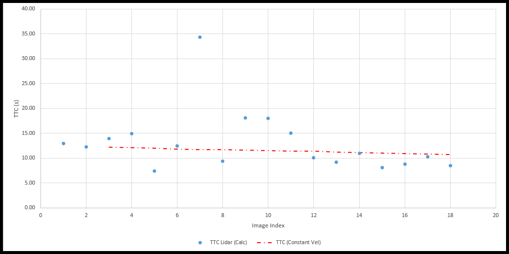
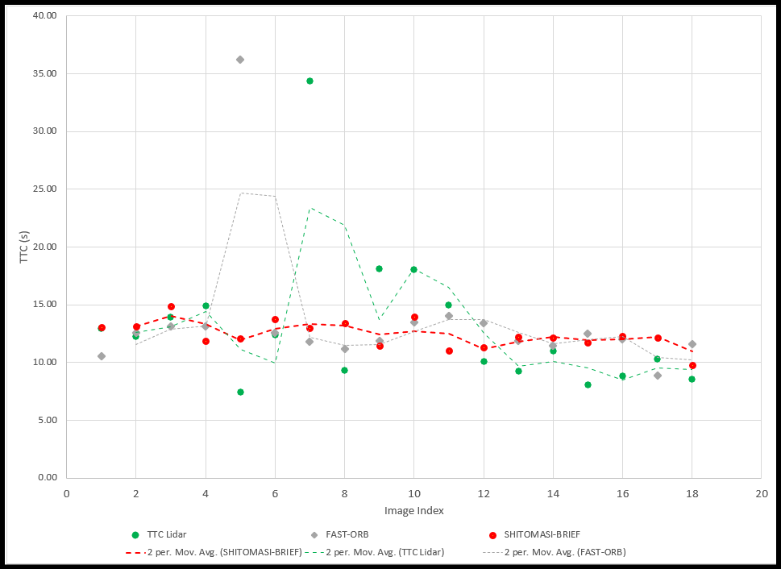

# SFND 3D Object Tracking


---

The objective of this project is to develop a software pipeline to detect and track objects in a 3D space using camera and Lidar measurements and use both to estimate the time-to-collision (TTC) with the preceding vehicle at each time step.
The project is part of the Udacity Sensor Fusion Nanodegree program.

The project is divided into 4 parts:

1. First, develop a way to match 3D objects over time by using keypoint correspondences.
2. Second, compute the TTC based on Lidar measurements.
3. Then proceed to do the same using the camera, which requires to first associate keypoint matches to regions of interest and then to compute the TTC based on those matches.
4. And lastly, conduct various tests with the framework. The goal is to identify the most suitable detector/descriptor combination for TTC estimation and also to search for problems that can lead to faulty measurements by the camera or Lidar sensor.

The code is structured as shown on the right half of image below:


## Dependencies for Running Locally

- cmake >= 2.8
  - All OSes: [click here for installation instructions](https://cmake.org/install/)
- make >= 4.1 (Linux, Mac), 3.81 (Windows)
  - Linux: make is installed by default on most Linux distros
  - Mac: [install Xcode command line tools to get make](https://developer.apple.com/xcode/features/)
  - Windows: [Click here for installation instructions](http://gnuwin32.sourceforge.net/packages/make.htm)
- Git LFS
  - Weight files are handled using [LFS](https://git-lfs.github.com/)
  - Install Git LFS before cloning this Repo.
- OpenCV >= 4.1
  - This must be compiled from source using the `-D OPENCV_ENABLE_NONFREE=ON` cmake flag for testing the SIFT and SURF detectors.
  - The OpenCV 4.1.0 source code can be found [here](https://github.com/opencv/opencv/tree/4.1.0)
- gcc/g++ >= 5.4
  - Linux: gcc / g++ is installed by default on most Linux distros
  - Mac: same deal as make - [install Xcode command line tools](https://developer.apple.com/xcode/features/)
  - Windows: recommend using [MinGW](http://www.mingw.org/)

## Basic Build Instructions

1. Clone this repo.
2. Go to the folder `Sensor_Fusion_Engineer/Camera/SFND_3D_Object_Tracking_FinalProject`
3. Make a build directory in the top level project directory: `mkdir build && cd build`
4. Compile: `cmake .. && make`
5. Run it: `./3D_object_tracking`.

## Task FP0: Final Report

This README.md file is the final report for the project. It contains all the information required to understand the project and its results.

## Task FP1: Match 3D Objects

The first part of the project is to develop a way to match 3D objects over time by using keypoint correspondences. The code for this part is implemented in the `matchBoundingBoxes` function in the `camFusion_Student.cpp` file. The function takes as input both the previous and the current data frames and provides as output the ids of the matched regions of interest (ROI). The code is implemented as follows:

```cpp
/**
 * @brief Match list of 3D objects (vector<BoundingBox>) between current and previous frame
 *
 * @param matches       List of best matches between previous and current frame
 * @param bbBestMatches Output list of best matches between previous and current frame (matched boxID pairs)
 * @param prevFrame     Previous frame
 * @param currFrame     Current frame
 */
void matchBoundingBoxes(std::vector<cv::DMatch> &matches, std::map<int, int> &bbBestMatches, DataFrame &prevFrame, DataFrame &currFrame)
{

    /* STEP 1 : Go through all keypoint matches and associate them with their respective bounding boxes in both images */

    std::multimap<int, int> bbTempMatches;

    // Loop over all the keypoint match pairs
    for (auto matchIt = matches.begin(); matchIt != matches.end(); ++matchIt)
    {
        int prevImgBoxID = -1;
        int currImgBoxID = -1;

        // Loop through all the BBoxes in previous image and find the box ID of the 'query' keypoint(match keypoint in previous image)
        for (auto it = prevFrame.boundingBoxes.begin(); it != prevFrame.boundingBoxes.end(); ++it)
        {
            cv::KeyPoint keyPt;
            keyPt = prevFrame.keypoints[matchIt->queryIdx];
            if (it->roi.contains(keyPt.pt))
            // if ((keyPt.pt.x > (it->roi.x)) && (keyPt.pt.x < (it->roi.x + it->roi.width)) &&
            //     (keyPt.pt.y > (it->roi.y)) && (keyPt.pt.y < (it->roi.y + it->roi.height)))
            {
                it->keypoints.push_back(keyPt);
                prevImgBoxID = it->boxID;
                break;
            }
        }

        // Loop through all the BBoxes in current image and find the box ID of the 'train' keypoint(match keypoint in current image)
        for (auto it = currFrame.boundingBoxes.begin(); it != currFrame.boundingBoxes.end(); ++it)
        {
            cv::KeyPoint keyPt;
            keyPt = currFrame.keypoints[matchIt->trainIdx];
            if (it->roi.contains(keyPt.pt))
            // if ((keyPt.pt.x > (it->roi.x)) && (keyPt.pt.x < (it->roi.x + it->roi.width)) &&
            //     (keyPt.pt.y > (it->roi.y)) && (keyPt.pt.y < (it->roi.y + it->roi.height)))
            {
                it->keypoints.push_back(keyPt);
                currImgBoxID = it->boxID;
                break;
            }
        }

        // Store the box ID pairs in a temporary multimap
        if ((prevImgBoxID != -1) && (currImgBoxID != -1)) // Exclude pairs which are not part of either BBoxes
        {
            bbTempMatches.insert(std::make_pair(prevImgBoxID, currImgBoxID));
        }

    } // eof Loop over all keypoint match pairs

    /* STEP 2: For each BBox pair count the number of keypoint matches*/

    // Find all the unique keys (BBox IDs in the prev image) from the multimap
    std::set<int> unique_keys;
    int last_key = INT_MIN; // some value that won't appear

    for (auto it = bbTempMatches.begin(); it != bbTempMatches.end(); ++it)
    {
        if (it->first != last_key)
        {
            unique_keys.insert(it->first);
            last_key = it->first;
        }
    }

    // Display contents of multimap
    if (false)
    {
        for (auto itr = bbTempMatches.begin(); itr != bbTempMatches.end(); ++itr)
        {
            cout << '\t' << itr->first << '\t' << itr->second
                 << '\n';
        }
    }

    // Create a map to count occurrences of each key-value pair
    std::map<std::pair<int, int>, int> count_map;

    // Loop through each element in the multimap
    for (auto it = bbTempMatches.begin(); it != bbTempMatches.end(); ++it)
    {
        // Create a pair from the key and value of multimap
        std::pair<int, int> key_value_pair = std::make_pair(it->first, it->second);

        // Check if the pair already exists in count_map
        if (count_map.find(key_value_pair) == count_map.end())
        {
            // If not, insert it with a count of 1
            count_map.insert(std::make_pair(key_value_pair, 1));
        }
        else
        {
            // If it exists, increment the count
            count_map[key_value_pair]++;
        }
    }

    // Display the count of each key-value pair
    if (false)
    {
        for (auto it = count_map.begin(); it != count_map.end(); ++it)
        {
            std::cout << "(" << it->first.first << ", " << it->first.second << "): " << it->second << std::endl;
        }
    }

    /* STEP 3: The BBox pair with highest number of keypoint match occurences is the best matched BBox pair*/

    // Iterate through each unique bounding box IDs in the previous image
    for (auto it = unique_keys.begin(); it != unique_keys.end(); ++it)
    {
        int BBoxIdx1 = -1; // BBox index
        int BBoxIdx2 = -1;
        int maxKyPtCnt = INT_MIN;

        // Loop through all the BBox matched pairs and find the ones with highest keypoint occurences
        for (auto it1 = count_map.begin(); it1 != count_map.end(); ++it1)
        {
            int currKyPtCnt = it1->second; // Number of occurences for the current BBox pair

            if (it1->first.first == *it)
            {
                if (currKyPtCnt >= maxKyPtCnt)
                {
                    maxKyPtCnt = currKyPtCnt;
                    BBoxIdx1 = it1->first.first;
                    BBoxIdx2 = it1->first.second;
                }
            }
        }

        if ((BBoxIdx1 != -1) && (BBoxIdx2 != -1)) // Exclude pairs which are not part of either BBoxes
        {
            bbBestMatches.insert(std::make_pair(BBoxIdx1, BBoxIdx2));
        }
    }
}
```

As you can see, the code is divided into 3 steps:

1. Go through all keypoint matches and associate them with their respective bounding boxes in both images
2. For each BBox pair count the number of keypoint matches
3. The BBox pair with highest number of keypoint match occurences is the best matched BBox pair

## Task FP2: Compute Lidar-based TTC

The second part of the project is to compute the time-to-collision (TTC) based on Lidar measurements. The code for this part is implemented in the `computeTTCLidar` function in the `camFusion_Student.cpp` file. The function takes as input both the previous and the current data frames and provides as output the TTC. The code is implemented as follows:

```cpp
/**
 * @brief Compute time-to-collision (TTC) based on Lidar measurements
 *
 * @param lidarPointsPrev Previous Lidar points
 * @param lidarPointsCurr Current Lidar points
 * @param frameRate       Frame rate of the camera
 * @param TTC             Output TTC
 */
void computeTTCLidar(std::vector<LidarPoint> &lidarPointsPrev,
                     std::vector<LidarPoint> &lidarPointsCurr, double frameRate, double &TTC, double &velLidar)
{
    // auxiliary variables
    double dT = 1.0 / frameRate; // time between two measurements in seconds
    std::vector<double> lidarPointsPrevX, lidarPointsCurrX;
    std::vector<double> filtLidarPointsPrevX, filtLidarPointsCurrX;

    // Create vector of all x points from previous and current Lidar points
    for (auto it = lidarPointsPrev.begin(); it != lidarPointsPrev.end(); ++it)
    {
        lidarPointsPrevX.push_back(it->x);
    }

    for (auto it = lidarPointsCurr.begin(); it != lidarPointsCurr.end(); ++it)
    {
        lidarPointsCurrX.push_back(it->x);
    }

    // Filter out outliers from the X-distance vector
    filtLidarPointsPrevX = removeOutliers(lidarPointsPrevX);
    filtLidarPointsCurrX = removeOutliers(lidarPointsCurrX);

    // find closest distance to Lidar points within ego lane
    double minXPrev = INT_MAX, minXCurr = INT_MAX;
    for (auto it = filtLidarPointsPrevX.begin(); it != filtLidarPointsPrevX.end(); ++it)
    {
        minXPrev = minXPrev > *it ? *it : minXPrev;
    }

    for (auto it = filtLidarPointsCurrX.begin(); it != filtLidarPointsCurrX.end(); ++it)
    {
        minXCurr = minXCurr > *it ? *it : minXCurr;
    }

    // Print both the minimum X distances in same line
    if (false)
    {
        std::cout << "minXPrev = " << minXPrev << " minXCurr = " << minXCurr << std::endl;
    }

    // compute TTC from both measurements
    TTC = minXCurr * dT / (minXPrev - minXCurr);
}
```

The code works as follows:

1. Create vector of all x points from previous and current Lidar points
2. Filter out outliers from the X-distance vector.

   The `removeOutliers` function uses the IQR (Inter Quartile Range) of data to remove outliers. The code is implemented as follows:

   ```cpp
    /**
    * @brief Function to remove outliers based on IQR
    *
    * @param data                  Input dataset
    * @return std::vector<double>  Filtered dataset
    */
    std::vector<double> removeOutliers(const std::vector<double> &data)
    {
        std::vector<double> sorted_data = data;
        std::sort(sorted_data.begin(), sorted_data.end());

        double q1 = percentile(sorted_data, 0.25); // 25th Percentile
        double q3 = percentile(sorted_data, 0.75); // 75th Percentile

        double iqr = q3 - q1;

        std::vector<double> filtered_data;
        for (double x : data)
        {
            if (x >= q1 - 1.5 * iqr && x <= q3 + 1.5 * iqr)
            {
                filtered_data.push_back(x);
            }
        }

        return filtered_data;
    }

   ```

3. Find closest distance to Lidar points within ego lane
4. Compute TTC from both measurements

## Task FP3: Associate Keypoint Correspondences with Bounding Boxes


This part of the project is to associate keypoint matches to regions of interest or bounding boxes which enclose them and then later to compute the TTC based on those matches. The code for this part is implemented in the `clusterKptMatchesWithROI` function in the `camFusion_Student.cpp` file. The code is implemented as follows:

```cpp
/**
 * @brief Cluster keypoint matches with the current bounding box
 *
 * @param boundingBox   Current bounding box
 * @param kptsPrev      Previous frame keypoints
 * @param kptsCurr      Current frame keypoints
 * @param kptMatches    Keypoint matches between previous and current frame
 */
void clusterKptMatchesWithROI(BoundingBox &boundingBox, std::vector<cv::KeyPoint> &kptsPrev, std::vector<cv::KeyPoint> &kptsCurr, std::vector<cv::DMatch> &kptMatches)
{
    /* STEP 1: Associate the keypoint match with the bounding box and calculate keypoint match distance*/

    // Loop through all the keypoint matches and find the ones which are part of the current bounding box
    // Also find the distance between the matched keypoints
    std::vector<double> distKptMatches;
    for (auto it = kptMatches.begin(); it != kptMatches.end(); ++it)
    {
        cv::KeyPoint keyPtPrev, keyPtCurr;
        double dist;
        keyPtPrev = kptsPrev[it->queryIdx];
        keyPtCurr = kptsCurr[it->trainIdx];

        if (boundingBox.roi.contains(keyPtCurr.pt))
        {
            boundingBox.kptMatches.push_back(*it);
            dist = cv::norm(keyPtCurr.pt - keyPtPrev.pt);
            distKptMatches.push_back(dist);
        }
    }

    /*STEP 2: Remove outlier keypoint matches from the bounding box*/

    // Get the Q1 and Q3 percentile for the distance vector
    double q1 = percentile(distKptMatches, 0.25);
    double q3 = percentile(distKptMatches, 0.75);
    // Find the IQR for the distance vector
    double iqr = q3 - q1;

    // Go through all the matched keypoint pairs in the current bounding box and remove the ones which are outliers from the bounding box
    auto it1 = boundingBox.kptMatches.begin();
    while (it1 != boundingBox.kptMatches.end())
    {
        cv::KeyPoint keyPtPrev, keyPtCurr;
        double dist;
        keyPtPrev = kptsPrev[it1->queryIdx];
        keyPtCurr = kptsCurr[it1->trainIdx];
        dist = cv::norm(keyPtCurr.pt - keyPtPrev.pt);

        if ((dist < (q1 - 1.5 * iqr)) || (dist > (q3 + 1.5 * iqr)))
        {
            it1 = boundingBox.kptMatches.erase(it1); // erase() returns the next iterator
        }
        else
        {
            ++it1;
        }
    }
}
```

I use the IQR of the euclidean distances between all the matched keypoints in the current bounding box to remove outliers matches.

## Task FP4: Compute Camera-based TTC

This part of the project is to compute the time-to-collision (TTC) based on camera measurements. The code for this part is implemented in the `computeTTCCamera` function in the `camFusion_Student.cpp` file. The code is implemented as follows:

```cpp
/**
 * @brief Compute time-to-collision (TTC) based on keypoint correspondences in successive images
 *
 * @param kptsPrev      Previous frame keypoints
 * @param kptsCurr      Current frame keypoints
 * @param kptMatches    Keypoint matches between previous and current frame
 * @param frameRate     Frame rate of the camera
 * @param TTC           Output TTC
 * @param visImg        Output visualization image
 */
void computeTTCCamera(std::vector<cv::KeyPoint> &kptsPrev, std::vector<cv::KeyPoint> &kptsCurr,
                      std::vector<cv::DMatch> kptMatches, double frameRate, double &TTC, cv::Mat *visImg)
{
    /* STEP 1: Compute distance ratios between all matched keypoints*/

    vector<double> distRatios; // stores the distance ratios for all keypoints between curr. and prev. frame
    for (auto it1 = kptMatches.begin(); it1 != kptMatches.end() - 1; ++it1)
    { // outer keypoint match  loop

        // get current keypoint and its matched partner in the prev. frame
        cv::KeyPoint kpOuterCurr = kptsCurr.at(it1->trainIdx);
        cv::KeyPoint kpOuterPrev = kptsPrev.at(it1->queryIdx);

        for (auto it2 = kptMatches.begin() + 1; it2 != kptMatches.end(); ++it2)
        { // inner keypoint match loop

            double minDist = 100.0; // min. required distance in pixels

            // get next keypoint and its matched partner in the prev. frame
            cv::KeyPoint kpInnerCurr = kptsCurr.at(it2->trainIdx);
            cv::KeyPoint kpInnerPrev = kptsPrev.at(it2->queryIdx);

            // compute distances and distance ratios
            double distCurr = cv::norm(kpOuterCurr.pt - kpInnerCurr.pt);
            double distPrev = cv::norm(kpOuterPrev.pt - kpInnerPrev.pt);

            if (distPrev > std::numeric_limits<double>::epsilon() && distCurr >= minDist)
            { // avoid division by zero

                double distRatio = distCurr / distPrev;
                distRatios.push_back(distRatio);
            }
        } // eof inner loop over all matched kpts
    }     // eof outer loop over all matched kpts

    // only continue if list of distance ratios is not empty
    if (distRatios.size() == 0)
    {
        TTC = NAN;
        return;
    }

    /* STEP 2: Filter out outliers from the distance ratio vector*/

    // Remove the outliers from the distance ratio vector
    std::vector<double> filtDistRatios = removeOutliers(distRatios);

    /* STEP 3: Compute camera-based TTC from distance ratios*/

    // Compute camera-based TTC from distance ratios using median
    double medianDistRatio;

    std::sort(filtDistRatios.begin(), filtDistRatios.end());
    if (distRatios.size() % 2 == 0)
    {
        medianDistRatio = (filtDistRatios[filtDistRatios.size() / 2 - 1] + filtDistRatios[filtDistRatios.size() / 2]) / 2;
    }
    else
    {
        medianDistRatio = filtDistRatios[filtDistRatios.size() / 2];
    }

    TTC = -dT / (1 - medianDistRatio);

}
```

The code works as follows:

1. Compute distance ratios between all matched keypoints
2. Filter out outliers from the distance ratio vector
3. Compute camera-based TTC from median distance ratios

## Task FP5: Performance Evaluation 1

Find examples where the TTC estimate of the Lidar sensor does not seem plausible.
The excel file for this part is available at `Task_FP5_FP6_PerformanceEvaluation/TaskFP5_LidarTTCPerformanceEvaluation.xlsx`
| Image Index | TTC Lidar (Calc) |
| ----------- | ---------------- |
| 1 | 12.97 |
| 2 | 12.26 |
| 3 | 13.92 |
| 4 | 14.89 |
| 5 | 7.42 |
| 6 | 12.42 |
| 7 | 34.34 |
| 8 | 9.34 |
| 9 | 18.13 |
| 10 | 18.03 |
| 11 | 14.99 |
| 12 | 10.10 |
| 13 | 9.22 |
| 14 | 10.97 |
| 15 | 8.09 |
| 16 | 8.81 |
| 17 | 10.29 |
| 18 | 8.52 |

The graph below shows the TTC Lidar values for all the 18 images. The TTC values are not consistent and vary a lot. This could be because the TTC is calculated using constant velocity model. This is not a good assumption as the velocity of the preceding vehicle is not constant. The red line in image shows the TTC if a constant velocity model is used.

Another reason could be due to calculation of TTC using the minimum X distance of the Lidar points which is a single point. This point can also be noise. This might be improved by using the median of the X distances of the Lidar points.



## Task FP6: Performance Evaluation 2

Run several detector / descriptor combinations and look at the differences in TTC estimation. Find out which methods perform best and also include several examples where camera-based TTC estimation is way off.
The excel file for this part is available at `Task_FP5_FP6_PerformanceEvaluation/TaskFP6_CameraTTCPerformanceEvaluation.xlsx`

In the excel the TTC Camera was calculated for multiple combinations of detector and descriptors (which are same as mid term project). Out of all the combinations, the best TTC Camera values were obtained for the following combinations:

For fast execution time: FAST - ORB
For good accuracy: SHITOMASI - BRIEF

The table below shows the value of TTC Camera for the above two combinations compared to TTC Lidar:

| TTC Lidar | FAST-ORB | SHITOMASI-BRIEF |
| --------- | -------- | --------------- |
| 12.97     | 10.50    | 13.05           |
| 12.26     | 12.58    | 13.15           |
| 13.92     | 13.13    | 14.86           |
| 14.89     | 13.12    | 11.85           |
| 7.42      | 36.21    | 12.06           |
| 12.42     | 12.56    | 13.73           |
| 34.34     | 11.82    | 13.00           |
| 9.34      | 11.20    | 13.39           |
| 18.13     | 11.89    | 11.47           |
| 18.03     | 13.47    | 13.94           |
| 14.99     | 14.00    | 11.05           |
| 10.10     | 13.39    | 11.32           |
| 9.22      | 11.84    | 12.25           |
| 10.97     | 11.41    | 12.17           |
| 8.09      | 12.49    | 11.69           |
| 8.81      | 11.99    | 12.31           |
| 10.29     | 8.88     | 12.14           |
| 8.52      | 11.61    | 9.74            |

The same data is plotted in the graph below:



As it can be seen in the image the TTC computation for SHITOMASI - BRIEF combination is very consistent and has less variation compared to others. The TTC computation for FAST - ORB combination is not very close to the TTC Lidar values and has variations. This could be because the FAST detector is not very robust to changes in illumination and viewpoint. The ORB descriptor is not very robust to viewpoint changes. This could be the reason for the poor performance of the FAST - ORB combination.
Also the bounding box does not always perfectly enclose just the preeding object and sometimes contains keypoint matches from soem sections of road (It can be see in the keypoint match gif shown in Task FP3). 
