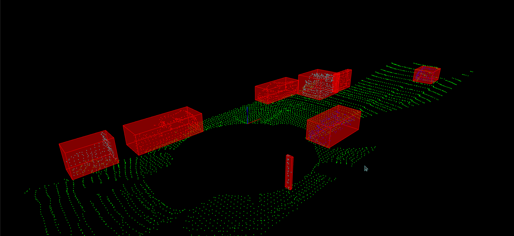
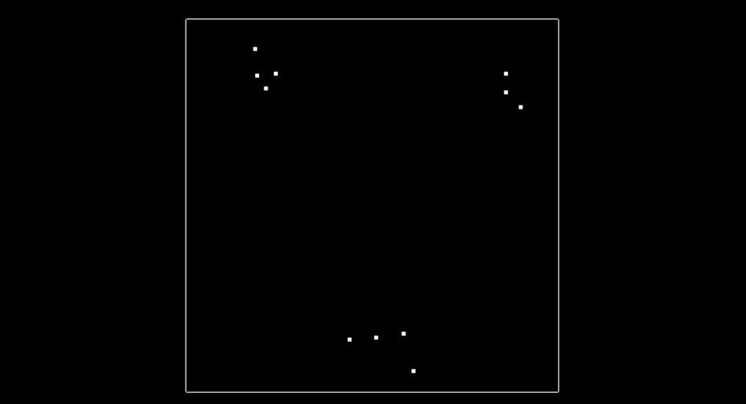
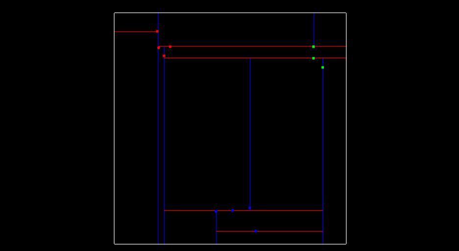

# **LiDAR Point Cloud Clustering**


---
## 1. Introduction
In the previous section, we learned about the RANSAC algorithm which is used to separate the ground plane (e.g road) from the rest of the point cloud which are obstacles. In this section, we will learn about the clustering algorithm which is used to separate the obstacles from each other. It is important to break up and group the obstacle points, especially if we want to do multiple object tracking with cars, pedestrians, and bicyclists, for instance. One way to do that grouping and cluster point cloud data is called euclidean clustering.

The idea is we associate groups of points by how close together they are. To do a nearest neighbor search efficiently, we use a KD-Tree data structure which, on average, speeds up our look up time from O(n) to O(log(n)). This is because the tree allows us to better break up our search space. By grouping points into regions in a KD-Tree, we can avoid calculating distance for possibly thousands of points just because we know they are not even considered in a close enough region. 

We will split the clustering algorithm into two parts. In the first part, we will implement the KD-Tree algorithm. In the second part, we will implement the euclidean clustering algorithm. In order to simplify, i will explain the clustering using a 2D point cloud. However, the same algorithm can be used for 3D point clouds.

## 2. How to run the code
The kd tree is implemented in the file `kdtree.h`. The euclidean clustering algorithm is implemented in the file `cluster.cpp`. All the codes are implemented in the `src/quiz/cluster` folder. The code can be compiled and run using the following commands:

1. Clone this repository to your local machine
```bash
cd ~  
git clone https://github.com/nikhilnair8490/UdacityProjects.git
```
1. Go to the project folder

`UdacityProjects/Sensor_Fusion_Engineer/Lidar_Obstacle_Detection/src/quiz/cluster`

3. Make a build directory in this folder: 
```bash
mkdir build && cd build
```
4. Run the following commands to build & view the 2d ransac:
 ```bash
CMake ..
make
./quizCluster
```
6. You should now see the visualization of the 2d point cloud data with clusters and the tree structure


## 3. Kd- Tree Implementation
The Kd-Tree (K-dimensional tree) is a binary tree that is recursively split on each dimension. The tree is built by sorting the points along each dimension and then splitting the points into two equal halves. The Kd-Tree is a very efficient data structure for nearest neighbor search. By separating space by splitting regions, nearest neighbor search can be made much faster when using an algorithm like euclidean clustering.

 

The left image is the 2d point cloud data. The image on the right is the Kd-Tree data structure representing the same point cloud data. The blue lines split the x-region and the red lines split the y-region. In this simple example there are only 11 points, and there are three clusters where points are in close proximity to each other. We will implement the algorithm to cluster these points in the euclidean clustering section.

First we will see how to insert a point into the tree. The function `insert` takes in a point and an id. The point is the coordinate ( {x,y} or {x,y,z} ) and the id is the index of point in the cloud. It works in the following way:
- The function `insert` first checks if the root is NULL. If it is NULL, then it creates a new node from the point and assigns it as the root. ROOT is the starting node of the tree.
- If the root is not NULL, then it traverses through the tree and finds an empty slot to place the new point.
  - The `depth % dim` expression is used to alternate between the x, y (and z) dimensions of the point. The `depth` variable is incremented by 1 for each level of the tree. The `depth % dim` expression is used as the index of the point vector. For example, if the `depth` variable is 0, then the first dimension of the point is used to insert the point. If the `depth` variable is 1, then the second dimension of the point is used to insert the point.
  - To choose between the right vs left branch of the tree we compare the respective dimension of the point with the respective dimension of the existing node in the tree. For example, if the point to be inserted is {3, 5} and the root node of the tree is {2, 4}, then we compare the x dimension of the point with the x dimension of the node. If the x dimension of the point is less than the x dimension of the node, then we go to the left branch of the tree. If the x dimension of the point is greater than the x dimension of the node, then we go to the right branch of the tree. In the example since the x dimension of the point (3) is greater than the x dimension of the node (2), we go to the right branch of the tree. 
  - We repeat this step for each alternating dimensions till we find an empty slot (NULL node) to insert the point.
> Note: Having a balanced tree that evenly splits regions improves the search time for finding points. Insert points that alternate between splitting the x region and the y region evenly. To do this pick the median of sorted x and y points. If there is an even number of elements the lower median is chosen. This ordering will allow the tree to more evenly split the region space and improve search time.

```cpp
	void insert(std::vector<float> point, int id)
	{
		// Function to insert a new point into the tree

		// Get the dimensions of point
		uint dim = point.size();

		// Limit dim to max 3 dimensions (x, y, z)
		if (dim > 3)
		{
			dim = 3;
		}

		// Insert the point as root if the root is NULL
		if (root == NULL)
		{
			root = new Node(point, id);
			return;
		}
		else
		{
			// Create a new node from the point
			Node *newNode = new Node(point, id);
			// Traverse through the tree and find an empty slot to place the new point
			Node *temp = root; // Start from root node
			uint depth = 0;	   // depth of tree
			while (temp != NULL)
			{
				// Alternate between each dim of point and insert the point in the empty slot
				if (point[depth % dim] < temp->point[depth % dim])
				{
					// Assign the next empty node on left branch
					if (temp->left == NULL)
					{
						temp->left = newNode;
						return;
					}
					temp = temp->left;
				}
				else
				{
					// Assign the next empty node on right branch
					if (temp->right == NULL)
					{
						temp->right = newNode;
						return;
					}
					temp = temp->right;
				}
				// If there are no empty slots in current level go to next depth (level) of tree
				depth += 1;
			}
		}

		return;
	}
```

Next we will see how to search for all the nearest neighbor points within a given distance of a target point. Points within a distance of distanceTol are considered to be nearby. The KD-Tree is able to split regions and allows certain regions to be completely ruled out, speeding up the process of finding nearby neighbors. The function `search` takes in a target point and a distance tolerance. It returns a vector of ids (indices) of all the points within the distance tolerance of the target point. The function `searchRecursive` is a helper function that is called recursively to search for all the points within the distance tolerance of the target point. The function `searchRecursive` takes in the current node, the target point, the distance tolerance, a vector of ids, and the depth of the tree. It works in the following way:
- The naive approach of finding nearby neighbors is to go through every single point in the tree and compare their distances with the target, selecting point indices that fall within the distance tolerance of the target. 
- Instead with the KD-Tree we can compare distance within a boxed square that is 2 x distanceTol for length, centered around the target point. If the current node point is within this box then we can directly calculate the euclidean distance and see if the point id should be added to the list of nearby ids. This way we don't calculate the euclidean distance for all the points, but only for the points that are within the box.
- Then we see if the box crosses over the node division region and if it does, compare that next node. We do this recursively, with the advantage being that if the box region is not inside some division region we completely skip that branch.

```cpp
	std::vector<int> search(std::vector<float> target, float distanceTol)
	{
		std::vector<int> ids;
		// Recursive helper function to search for all nearest neighbors of target
		searchRecursive(root, target, distanceTol, ids, 0);

		return ids;
	}

	void searchRecursive(Node *node, std::vector<float> target, float distanceTol, std::vector<int> &ids, uint depth)
	{

		// Get the dimensions of target point
		uint dim = target.size();

		// Limit dim to max 3 dimensions (x, y, z)
		if (dim > 3)
		{
			dim = 3;
		}

		// Define target box boundaries
		// Note: Only spatial dimensions are used for the search criteria. This will work for both 2-d and 3-d cases

		// Define an empty array of size 2*dim (size of target box)
		std::vector<float> tarBox(2 * dim);

		// Define the boundaries of the target box
		for (uint i = 0; i < dim; ++i)
		{
			tarBox[i] = target[i] - distanceTol;
			tarBox[i + dim] = target[i] + distanceTol;
		}

		if (node != NULL)
		{
			bool isWithin = true;
			// Check if the node point is within target box tarBox.
			for (uint j = 0; j < dim; ++j)
			{
				if (node->point[j] < tarBox[j] || node->point[j] > tarBox[j + dim])
				{
					isWithin = false;
					break;
				}
			}

			if (isWithin)
			{
				// Calculate euclidean distance of target from the node point
				float distance = 0.0;
				for (uint k = 0; k < dim; ++k)
				{
					distance += pow(node->point[k] - target[k], 2);
				}
				distance = sqrt(distance);

				// If the node point is within the distanceTol add it in ids
				if (distance <= distanceTol)
				{
					ids.push_back(node->id);
				}
			}

			// Check if the target box crosses left node boundary
			if ((target[depth % dim] - distanceTol) < node->point[depth % dim])
				// Explore the left subtree
				searchRecursive(node->left, target, distanceTol, ids, depth + 1);

			// Check if the target box crosses right node boundary
			if ((target[depth % dim] + distanceTol) > node->point[depth % dim])
				// Explore the right subtree
				searchRecursive(node->right, target, distanceTol, ids, depth + 1);
		}
	}

```

## 4. Euclidean Clustering
Once the KD-Tree method for searching for nearby points is implemented, the next step is to implement a euclidean clustering method that groups individual cluster indices based on their proximity.To perform the clustering, we iterate through each point in the cloud and keep track of which points have been processed already. For each point we add it to a list of points defined as a cluster, then get a list of all the points in close proximity to that point by using the search function from the K-d Tree section. For each point in close proximity that hasn't already been processed, add it to the cluster and repeat the process of calling proximity points. Once the recursion stops for the first cluster, we create a new cluster and move through the point list, repeating the above process for the new cluster. Once all the points have been processed, there will be a certain number of clusters found, which is returned as a list of clusters.

 

The output is shown on the image on right where each of the three nearby clusters is colored differently, red, blue, and green.

The function `euclideanCluster` takes in a list of points, a pointer to a KD-Tree, and a distance tolerance. The function returns a list of clusters, where each cluster is a list of point indices. 
- The function first creates an empty list of clusters, then iterates through each point in the list of points. 
- For each point, if the point has not been processed, create a new cluster, call the `proximity` function to find the nearest neighbors, and add the cluster to the list of clusters. 
- The `proximity` function takes in a list of points, an index, a cluster, a distance tolerance, a pointer to a Kd-Tree, and a list of processed points. The function first adds the point to the list of processed points, then adds the point to the cluster. 
- The function then finds the neighbors of the point in the cluster by calling the search function from the Kd-Tree. 
- The function then iterates through the neighbor points and finds their neighbors by calling the `proximity` function recursively. 
- Once the recursion stops, the function returns the list of clusters.

```cpp

std::vector<std::vector<int>> euclideanCluster(const std::vector<std::vector<float>> &points, KdTree2 *tree, float distanceTol)
{
	std::vector<std::vector<int>> clusters;

	// Create an empty unordered set
	std::unordered_set<int> processedPoints;

	// Iterate through each point in points
	for (int i = 0; i < points.size(); ++i)
	{
		// If the point has not been processed
		if (processedPoints.find(i) == processedPoints.end())
		{
			// Create a new cluster
			std::vector<int> cluster;
			// Call the proximity function to find nearest neighbors
			proximity(points, i, cluster, distanceTol, tree, processedPoints);
			// Add the cluster to the list of clusters
			clusters.push_back(cluster);
		}
	}

	return clusters;
}

void proximity(const std::vector<std::vector<float>> &points, int index, std::vector<int> &cluster, float distanceTol, KdTree2 *tree, std::unordered_set<int> &processedPoints)
{
	// Add point to processed
	processedPoints.insert(index);
	// Add point to cluster
	cluster.push_back(index);

	// Find neighbors of the point in the cluster
	std::vector<int> neighbors = tree->search(points[index], distanceTol);
	// Iterate through the neighbor points and find their neighbors
	for (int i = 0; i < neighbors.size(); ++i)
	{
		if (processedPoints.find(neighbors[i]) == processedPoints.end())
		{
			proximity(points, neighbors[i], cluster, distanceTol, tree, processedPoints);
		}
	}
	return;
}

```
> For a 3-D point cloud data, there is an additional step to create the bounding box. The bounding box is created by finding the minimum and maximum values of the x, y, and z coordinates of each of the cluster points. The bounding box volume could also be thought of as space the car is not allowed to enter, or it would result in a collision.

## Resources
These are some useful resources to learn more about the algorithms used in this project:
- [Euclidean Clustering for Lidar point cloud data](https://medium.com/@ajithraj_gangadharan/euclidean-clustering-for-lidar-point-cloud-data-8603f266b246)
- [K-d Trees - Computerphile](https://www.youtube.com/watch?v=BK5x7IUTIyU&ab_channel=Computerphile)
- [Clustering Algorithms: From Start to State of the Art](https://www.toptal.com/machine-learning/clustering-algorithms)