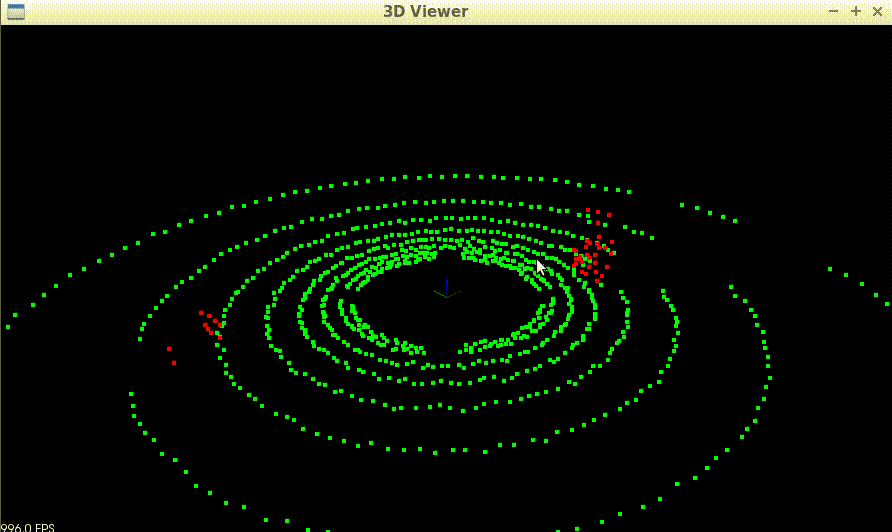
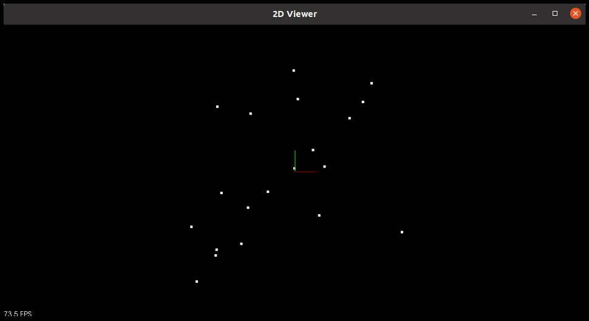
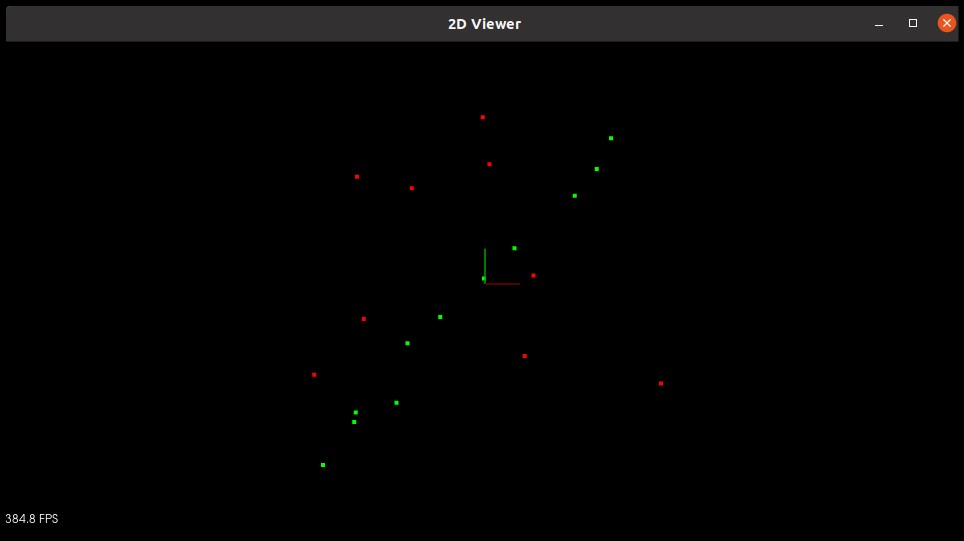
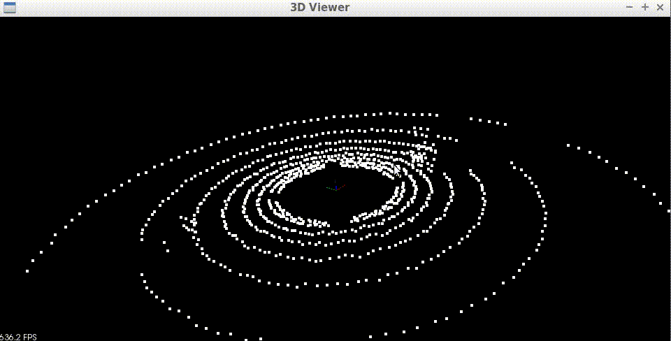

# **RANSAC Algorithm**


---
## 1. Introduction
RANSAC, which stands for "Random Sample Consensus," is an iterative algorithm mainly used in computer vision to estimate parameters of a mathematical model from a set of observed data points that may contain outliers. It is a non-deterministic algorithm in the sense that it produces a reasonable result only with a certain probability, with this probability increasing as more iterations are allowed.

In the context of autonomous vehicles, RANSAC can be used for tasks such as robustly fitting a model to lidar or camera sensor data, which can be noisy and contain erroneous measurements. One such application is identifying the ground plane from lidar sensor data. Since lidar data can be noisy and contain erroneous measurements, accurately identifying the ground plane is crucial for tasks such as obstacle detection, localization, and path planning.

The algorithm works by randomly selecting a subset of points from the point cloud and fitting a plane to those points. Then, the algorithm computes the number of inliers, which are points that are close enough to the plane, and outliers, which are points that are too far away from the plane.

The algorithm repeats this process multiple times and selects the subset that produces the largest number of inliers. This subset is then used to compute the final estimate of the plane parameters. The resulting plane model can then be used for tasks such as obstacle detection or road segmentation.

Overall, RANSAC is a powerful algorithm that can help improve the robustness and reliability of autonomous vehicle systems by allowing them to better interpret and make decisions based on sensor data that may contain outliers or other sources of noise.

We will implement the 2D and 3D RANSAC algorithm in this quiz. Our final goal is to identify a ground plane in a point cloud obtained from a lidar sensor mounted on an autonomous vehicle.

## 2. How to run the code
The code is implemented in the file `ransac2d.cpp` and `ransac3d.cpp`. The code is implemented in the `src/quiz/ransac` folder. The code can be compiled and run using the following commands:
1. Clone this repository to your local machine
```bash
cd ~  
git clone https://github.com/nikhilnair8490/UdacityProjects.git
```
2. Go to the project folder

`UdacityProjects/Sensor_Fusion_Engineer/Lidar_Obstacle_Detection/src/quiz/ransac`

3. Make a build directory in this folder: 
```bash
mkdir build && cd build
```
4. Run the following commands to build & view the 2d ransac:
 ```bash
CMake ..
make
./quizRansac
```
6. You should now see the visualization of the 2d point cloud data.

7. Run the following commands to view the 3d ransac:
 ```bash
make
./quizRansacPlane
```
8. You should now see the visualization of the 3d point cloud data.

## 3. 2D RANSAC
In this section, we will learn about the 2D RANSAC algorithm. Given a set of 2D points with some outliers, the algorithm will identify the line that best fits the points. The code is implemented in the file `ransac2d.cpp`.

The left image is the input point cloud with some outliers. The right image is the output point cloud with the line that best fits the points (Green points are inliers and red points are outliers).

 


- The function `CreateData` is used to create random data points in 2D space.
It also adds some outliers to the data points.

- The function `Ransac` is used to implement the RANSAC 2D algorithm.
The algorithm works by 
  - Randomly selecting a subset of points from the data points. For creating a line, we need two points.
  - Fit a line to those points using the general equation of a line  
  $$\bold{Ax + By + C = 0}$$
  - Then, the algorithm computes the number of inliers, which are points that are close enough (`distanceTol`) to the line by calculating the shortest distance between each point in the cloud to the line

  $$\operatorname{distanceTol}(Ax+By+C=0, (x_0, y_0)) = \frac{|Ax_0+By_0+C|}{\sqrt{A^2+B^2}}$$

  - It will repeat the above steps and select the subset that produces the largest number of inliers. This subset is then used to compute the final estimate of the line parameters.

```cpp
	for (size_t i = 0; i <= maxIterations; ++i)
	{
		// Randomly sample two points from the given point cloud
		pcl::PointXYZ p1 = cloud->points[rand() % cloud->points.size()];
		pcl::PointXYZ p2 = cloud->points[rand() % cloud->points.size()];

		// Fit a line between the points p1 and p2

		// Given two points: point1 (x1, y1) and point2 (x2, y2),
		// the line through point1 and point2 has the specific form:(y1−y2)x+(x2−x1)y+(x1∗y2−x2∗y1)=0
		// Coefficients of the line (Ax + By + C = 0)
		float A = (p1.y - p2.y);
		float B = (p2.x - p1.x);
		float C = (p1.x * p2.y - p2.x * p1.y);

		float d; // Shortest distance between point and line
		float num;
		float den;
		float x;
		float y;

		// Loop through all the points in the cloud
		for (size_t j = 0; j < cloud->points.size(); ++j)
		{
			// Point cloud coordinate
			x = cloud->points[j].x;
			y = cloud->points[j].y;

			// Shortest distance between the line Ax+ By + C = 0 and the point
			num = fabs(A * x + B * y + C);
			den = sqrt(A * A + B * B);
			d = num / den;

			// If d is less than distance threshold then add the point as inlier
			if (d < distanceTol)
			{
				inliersResultTemp.insert(j);
			}
		}

		numofInliers = inliersResultTemp.size();
		// If the current number of inliers are more than max then update max
		// and also update the inliers result
		if (numofInliers > numofInlierMax)
		{
			numofInlierMax = numofInliers;
			inliersResult = inliersResultTemp;
		}
		inliersResultTemp.clear();
	}
```
## 4. 3D RANSAC
The 3D RANSAC is similar to the 2D but the equations are for plane rather than line. This algorithm is used to separate the ground plane (e.g road) from the rest of the point cloud which are obstacles. 
The code is implemented in the file `ransac3d.cpp`.

The left gif is the input point cloud from a lidar sensor with the obstacles. The right gif is the output point cloud with the ground plane as green points and the obstacles as red points.

 


- The function `CreateData3D` is used to create the point cloud.

- The function `Ransac3d` is used to implement the RANSAC 3D algorithm.
The algorithm works by 
  - Randomly selecting a subset of points from the point cloud. For creating a plane we need 3 points.
  - Fit a plane to those points using the general equation of a plane  
$$\bold{Ax + By + Cz + D = 0}$$
  - Then, the algorithm computes the number of inliers, which are points that are close enough (`distanceTol`) to the plane by calculating the shortest distance between each point in the cloud to the plane

$$\operatorname{distanceTol}(Ax+By+Cz+D=0, (x_0, y_0, z_0)) = \frac{|Ax_0+By_0+Cz_0+D|}{\sqrt{A^2+B^2+C^2}}$$

  - It will repeat the above steps and select the subset that produces the largest number of inliers (largest plane in the cloud, which is ground plane). This subset is then used to compute the final estimate of the plane parameters.

```cpp
for (size_t i = 0; i <= maxIterations; ++i)
	{
		// Randomly sample three points from the given point cloud
		PointT p1 = cloud->points[rand() % cloud->points.size()];
		PointT p2 = cloud->points[rand() % cloud->points.size()];
		PointT p3 = cloud->points[rand() % cloud->points.size()];

		float x1, y1, z1, x2, y2, z2, x3, y3, z3;

		x1 = p1.x;
		y1 = p1.y;
		z1 = p1.z;
		x2 = p2.x;
		y2 = p2.y;
		z2 = p2.z;
		x3 = p3.x;
		y3 = p3.y;
		z3 = p3.z;

		// Check if all the points are non-collinear
		// Area of triangle formed from these points should be non-zero
		if ((x1 * (y2 - y3) + x2 * (y3 - y1) + x3 * (y1 - y2)) == 0)
		{
			continue;
		}

		// Fit a plane between the points p1, p2 and p3
		// General equation of plane (Ax + By + Cz + D = 0)
		float A = ((y2 - y1) * (z3 - z1)) - ((z2 - z1) * (y3 - y1));
		float B = ((z2 - z1) * (x3 - x1)) - ((x2 - x1)) * ((z3 - z1));
		float C = ((x2 - x1) * (y3 - y1)) - ((y2 - y1) * (x3 - x1));
		float D = -(A * x1 + B * y1 + C * z1);

		float d; // Shortest distance between point and plane
		float num;
		float den;
		float x;
		float y;
		float z;

		// Loop through all the points in the cloud
		for (size_t j = 0; j < cloud->points.size(); ++j)
		{
			// Point cloud coordinate
			x = cloud->points[j].x;
			y = cloud->points[j].y;
			z = cloud->points[j].z;

			// Shortest distance between the plane Ax+ By + Cz + D = 0 and the point (x,y,z)
			num = fabs(A * x + B * y + C * z + D);
			den = sqrt(A * A + B * B + C * C);
			d = num / den;

			// If d is less than distance threshold then add the point as inlier
			if (d < distanceTol)
			{
				inliersResultTemp.insert(j);
			}
		}

		// If the current number of inliers are more than max inliers,then update the max inliers result
		if (inliersResultTemp.size() > inliersResult.size())
		{
			inliersResult = inliersResultTemp;
		}
		inliersResultTemp.clear();
	}

```
## 5. Important parameters to tune for RANSAC
- `maxIterations`: The number of iterations to run the RANSAC algorithm. The higher the number of iterations, the more likely it is to find the correct model. However, the higher the number of iterations, the longer it will take to run the algorithm. The number of iteration is also related the percentage of outliers in the data set. The less outliers exist the less iteration we can expect.  
> The equation of the minimum number of iterations N that is necessary to find a best fit with a probability of success p is given by the following equation:

> $$ N = \frac{log(1-p)}{log(1-(1-e)^s)} $$  
> where:   
    - `p`: The probability of success after N iterations  
    - `e`: Outlier ratio 
    - `s`: The number of points required to fit the model  

- `distanceTol`: The distance threshold to determine whether a point is an inlier or not. It is closely related to the amount of noise we expect in the data. The higher the distance threshold, the more points will be considered as inliers. However, the higher the distance threshold, the more likely it is to find the wrong model.

## Resources
These are some useful resources to learn more about the algorithm:
- [RANSAC](https://en.wikipedia.org/wiki/Random_sample_consensus)
- [RANSAC - Random Sample Consensus (Cyrill Stachniss)](https://www.youtube.com/watch?v=Cu1f6vpEilg&ab_channel=CyrillStachniss)
- [Outlier detection using the RANSAC algorithm](https://medium.com/mlearning-ai/outlier-detection-using-the-ransac-algorithm-de52670adb4a)